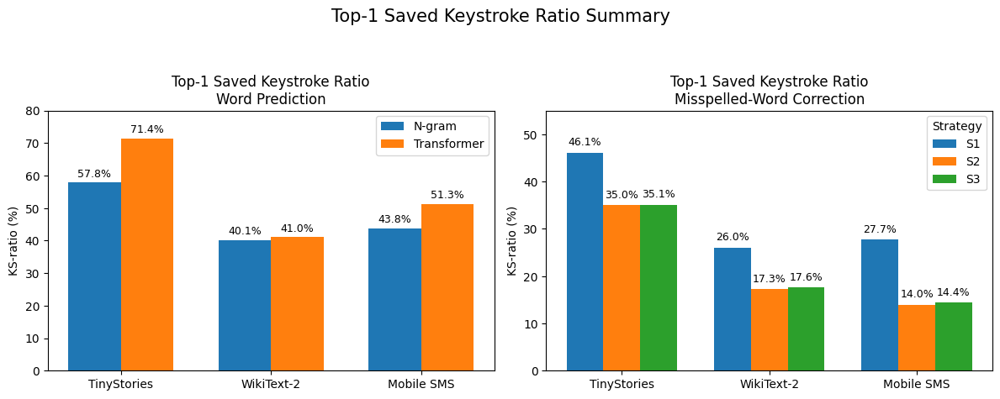
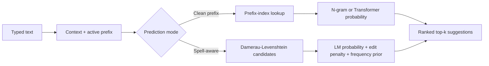

# Spell-Aware Word Prediction

[](https://www.python.org/)
[](https://pytorch.org/)
[](#train-the-transformer-models)
[](#train-the-n-gram-models)
[](#train-the-transformer-models)
[](#spell-correction-evaluation)
[](https://flask.palletsprojects.com/)
[](https://numpy.org/)
[](https://matplotlib.org/)
[](https://huggingface.co/docs/datasets/)
[](https://jupyter.org/)
[](https://docs.conda.io/)

> An end-to-end NLP system that compares statistical and neural language models, adds typo-tolerant candidate ranking, and exposes the result through an interactive web application.

## Table of Contents

- [Overview](#overview)
- [Demo](#demo)
- [Engineering Highlights](#engineering-highlights)
- [Key Results](#key-results)
  - [Visual Results](#visual-results)
- [From Theory to Product: Methodology](#from-theory-to-product-methodology)
- [Project Structure](#project-structure)
- [Datasets](#datasets)
- [Environment](#environment)
- [Train the N-gram Models](#train-the-n-gram-models)
- [Train the Transformer Models](#train-the-transformer-models)
- [Evaluate Word Prediction](#evaluate-word-prediction)
- [Spell Correction Evaluation](#spell-correction-evaluation)
- [Run the GUI Locally](#run-the-gui-locally)
  - [Fast Transformer Demo](#fast-transformer-demo)
- [Result Files](#result-files)

## Overview

This project implements and evaluates a spell-aware autocomplete system across three text domains: TinyStories, WikiText-2, and Mobile SMS. It compares a word-level interpolated n-gram language model with a custom decoder-only Transformer, then extends both with typo-tolerant candidate generation and reranking.

The work covers the complete ML lifecycle: dataset-specific preprocessing, model and tokenizer implementation, training, hyperparameter search, quantitative evaluation, inference optimization, and deployment in a local Flask interface. The Transformer and BPE tokenizer are implemented with PyTorch rather than delegated to a high-level Transformer library.

Project paper: [Spell-Aware Word Prediction Using N-gram and Transformer Language Models](./projectPDFVersion.pdf).

## Demo

<video src="https://raw.githubusercontent.com/NeguseNegest/NLP-project/main/_.mp4" controls width="100%">
  Your browser does not support embedded video. Use the link below to open the demo.
</video>

[Open or download the MP4 demo](./_.mp4).

## Engineering Highlights

| Area | What the implementation demonstrates |
|---|---|
| NLP and ML fundamentals | Custom BPE tokenization, causal multi-head self-attention, interpolated n-grams, add-one smoothing, and weighted Damerau-Levenshtein distance |
| Experimental design | Comparable evaluation across three domains, validation-driven interpolation weights, Transformer architecture search, and reproducible metric artifacts |
| Inference engineering | Vocabulary prefix indexes, pre-tokenized Transformer candidates, device selection, context-logit caching, and full-ranking reuse |
| Product engineering | A Flask GUI that switches datasets, model families, and spelling strategies, with automatic CUDA, MPS, or CPU device selection |
| Technical judgment | An explicit accuracy-latency comparison showing where a simpler statistical model remains preferable to a neural model |

## Key Results

Clean word prediction is strongest with the Transformer. At top-3, it reaches 97.18% accuracy on TinyStories, 93.74% on WikiText-2, and 97.70% on Mobile SMS. The n-gram model has lower accuracy, but still saves many keystrokes because prefix filtering becomes informative after a few typed characters.

| Dataset | N-gram Top-3 Acc | Transformer Top-3 Acc | N-gram Top-3 KS | Transformer Top-3 KS | N-gram PPL | Transformer PPL |
|---|---:|---:|---:|---:|---:|---:|
| TinyStories | 51.42% | 97.18% | 68.03% | 76.71% | 258.52 | 5.68 |
| WikiText-2 | 26.08% | 93.74% | 52.89% | 57.88% | 16,357.84 | 53.44 |
| Mobile SMS | 27.59% | 97.70% | 57.59% | 67.42% | 2,621.21 | 65.63 |

Spell correction shows a different pattern. S1, the one-edit strategy, is consistently strongest because it keeps the correction candidate set smaller. The n-gram model is stronger on TinyStories and WikiText-2 spell correction, while the Transformer is strongest on Mobile SMS.

| Dataset | Best S1 N-gram Top-3 Acc | Best S1 Transformer Top-3 Acc | Best S1 N-gram Top-3 KS | Best S1 Transformer Top-3 KS |
|---|---:|---:|---:|---:|
| TinyStories | 96.40% | 93.39% | 58.41% | 55.43% |
| WikiText-2 | 84.70% | 80.71% | 39.41% | 29.98% |
| Mobile SMS | 90.82% | 92.86% | 37.65% | 44.53% |

Main findings:

- The Transformer is much better for clean next-word prediction.
- Saved-keystroke ratio improves less dramatically than accuracy because the prefix index already narrows candidates as the user types.
- The n-gram model remains competitive for spell correction because it scores whole-word candidates directly.
- The Transformer performs best on Mobile SMS spell correction, where messages are short and patterned.
- S2 and S3 are weaker than S1 because allowing two edits introduces many plausible wrong candidates; S3 only slightly changes results compared with S2.
- Perplexity should be interpreted carefully across model families because n-gram perplexity is word-level, while Transformer perplexity is BPE-token-level.

### Visual Results



*Top-1 saved-keystroke ratio across datasets. The left panel compares clean word prediction; the right panel shows how the n-gram spell-aware system changes as the maximum edit distance increases.*

The Mobile SMS comparison below shows the same spell-aware tradeoff for both model families. S1 produces the strongest accuracy and keystroke savings because its one-edit constraint excludes many plausible but incorrect candidates.

<table>
  <tr>
    <td width="50%">
      
    </td>
    <td width="50%">
      
    </td>
  </tr>
  <tr>
    <td align="center"><strong>N-gram</strong></td>
    <td align="center"><strong>Transformer</strong></td>
  </tr>
</table>

## From Theory to Product: Methodology

The system treats autocomplete as a **retrieve-then-rank** problem. Retrieval reduces the vocabulary to plausible completions; ranking combines linguistic context with spelling evidence to decide which candidates should be shown first.



### 1. Candidate retrieval turns generation into a bounded ranking task

The input parser separates completed words from the active prefix: `"the quick br"` becomes context `the quick` and prefix `br`, while a trailing space requests a new word. For clean autocomplete, every vocabulary word is indexed by all of its prefixes, so a lookup returns only matching candidates. Spell-aware mode instead compares the typed prefix with the equally long prefix of each plausible vocabulary word, allowing the system to recover the intended completion before the word is finished.

The two model families receive data suited to their assumptions. The n-gram pipeline lowercases and cleans text into word-level sentences. The Transformer pipeline preserves more punctuation, case, and subword structure for BPE tokenization.

### 2. Interpolated n-grams provide a fast, interpretable baseline

The statistical model estimates a word from up to three preceding words and blends unigram through four-gram probabilities:

$$
P(w_i \mid h_i) = \sum_{n=1}^{4} \lambda_n P_n(w_i \mid w_{i-n+1}, \ldots, w_{i-1}),
\qquad \sum_{n=1}^{4}\lambda_n = 1.
$$

Each component uses add-one smoothing so unseen events retain non-zero probability. The interpolation weights are selected per dataset by grid search using top-3 saved-keystroke ratio as the validation objective. This lets the model adapt to domain structure: TinyStories favors four-gram context, while WikiText-2 and Mobile SMS benefit from different mixtures of shorter histories.

Because candidates are complete words, the n-gram model scores each option directly. That makes it inexpensive, explainable, and especially effective when edit distance has already produced a focused correction set.

### 3. The custom causal Transformer captures longer-range context

The neural model uses a dataset-specific BPE tokenizer and a decoder-only architecture built from PyTorch components. The standard configuration has four Transformer blocks, four attention heads, 256-dimensional embeddings, learned positional embeddings, pre-normalized residual connections, causal self-attention, and a feed-forward expansion to four times the embedding dimension.

Training converts each corpus to compact token-ID files and memory-maps overlapping input/target windows. The model minimizes next-token cross-entropy with AdamW, evaluates validation loss every 100 steps, and retains the best checkpoint. Architecture search compares model depth, head count, embedding width, and training-window stride; it records both validation loss and autocomplete metrics, with top-1 accuracy used to rank runs.

Causal masking enforces the language-modeling constraint that position $t$ can attend only to positions at or before $t$:

$$
\operatorname{Attention}(Q,K,V)
= \operatorname{softmax}\left(\frac{QK^\top}{\sqrt{d_k}} + M_{\text{causal}}\right)V.
$$

At inference time, word candidates share one cached next-token distribution for the current context. The reported experiments rank a candidate by the probability of its first BPE token, a deliberate approximation that avoids a separate autoregressive pass for every word. The fast GUI demo retains that score for one-token words and scores multi-token candidates autoregressively, then batches and prunes work to improve responsiveness. This distinction makes the evaluation protocol reproducible while exposing the latency-quality tradeoff of subword-based word completion.

### 4. Spell-aware autocomplete combines three sources of evidence

This project corrects an unfinished prefix, not a completed sentence. Candidate generation uses Damerau-Levenshtein distance, which models insertion, deletion, substitution, and adjacent transposition errors. Three strategies test the effect of widening and weighting the search:

| Strategy | Search rule | Intended tradeoff |
|---|---|---|
| S1 | Standard distance, maximum 1 edit | Small, high-precision candidate set |
| S2 | Standard distance, maximum 2 edits | Higher recall with more ambiguity |
| S3 | Weighted distance, maximum 2 edits | Lower penalty for likely operations such as transposition |

Candidates are reranked with a log-linear score:

$$
\operatorname{score}(c)
= \log P_{\text{LM}}(c \mid \text{context})
- \lambda_{\text{edit}}\,\widetilde d(c)
+ \mu_{\text{freq}}\,\widetilde f(c).
$$

Here, $\widetilde d$ is edit distance normalized by the permitted maximum and $\widetilde f$ is log word frequency normalized over the vocabulary. The first term rewards contextual fit, the second penalizes more aggressive corrections, and the third prevents rare but technically valid candidates from dominating. The two coefficients are tuned on fixed, synthetically corrupted validation examples rather than on the test set.

### 5. Evaluation measures usefulness, not only language-model fit

Top-k accuracy asks whether the intended word appears among the suggestions. Saved-keystroke ratio additionally measures whether it appears early enough to reduce typing, making it the closer proxy for product value. Perplexity measures model uncertainty, but is reported with a clear tokenization caveat: word-level n-gram and BPE-level Transformer perplexities are not directly equivalent.

The resulting comparison has no artificial single winner. The Transformer dominates clean prediction, the n-gram model remains strong and fast for word-level spell reranking, and the best Mobile SMS correction result comes from the Transformer. That outcome motivates a practical hybrid design: inexpensive filtering followed by stronger contextual reranking where its latency cost is justified.

## Project Structure

```text
NLP-project/
├── README.md
├── _.mp4
├── enviroment.yml
├── projectPDFVersion.pdf
├── models/
│   ├── ngram/
│   │   ├── Tiny_stories_ngram_model.pkl
│   │   ├── Wikitext2_ngram_model.pkl
│   │   └── mobile_sms_ngram_model.pkl
│   └── transformer/
│       ├── tinystories/
│       │   ├── checkpoint_final.pt
│       │   └── tokenizer.json
│       ├── wikitext2/
│       │   ├── checkpoint_final.pt
│       │   └── tokenizer.json
│       └── mobile_sms/
│           ├── checkpoint_final.pt
│           └── tokenizer.json
├── results/
│   ├── metrics/
│   └── plots/
└── scr/
    ├── gui_app.py
    ├── process_data_notebook.ipynb
    ├── generate_spell_eval_datasets.py
    ├── spell_param_validate.py
    ├── spell_corrector.py
    ├── transformer_model.py
    ├── data/
    │   ├── Data_unclean/mobiletext/
    │   ├── ngram_tiny_stories/
    │   ├── ngram_wikitext_2/
    │   ├── ngram_mobile/
    │   ├── tiny_stories_transformer/
    │   ├── wikitext_2_transformer/
    │   ├── mobile_transformers/
    │   └── data_for_spell_evaluation/
    ├── ngram/
    │   ├── ngram_train.py
    │   ├── ngram_evaluate.py
    │   ├── ngram_test.py
    │   └── ngram_spell_evaluate.py
    └── transformer/
        ├── transformer_train.py
        ├── transformer_grid_search.py
        ├── transformer_evaluate.py
        ├── transformer_spell_evaluate.py
        ├── tokenizer.py
        └── self_attention.py
```

## Datasets

The preprocessing code is documented in `scr/process_data_notebook.ipynb`.

| Dataset | Source | Use in project |
|---|---|---|
| TinyStories | https://huggingface.co/datasets/roneneldan/TinyStories | Simple narrative text |
| WikiText-2 | https://huggingface.co/datasets/Salesforce/wikitext | Wikipedia-style benchmark text |
| Mobile SMS / MobileText | https://digitalcommons.mtu.edu/mobiletext/1/ | Short informal messages |

For the n-gram model, text is lowercased, punctuation is removed, whitespace is normalised, and the model is trained on word-level lines. TinyStories and WikiText-2 are split into cleaned sentences. Mobile SMS is built from the MobileText `mobile_*` and `non-mobile_*` source files and written to `scr/data/ngram_mobile/`.

For the Transformer, text is only lightly normalised so that punctuation, case, and subword patterns remain available to the BPE tokenizer. TinyStories is kept as one story per line, WikiText-2 as non-empty paragraph-like lines, and Mobile SMS as one message per line in `scr/data/mobile_transformers/`.

Final preprocessed sizes:

| Dataset | N-gram train | N-gram validation | N-gram test | Transformer train | Transformer validation | Transformer test |
|---|---:|---:|---:|---:|---:|---:|
| TinyStories | 15,603,516 sentences | 193,167 sentences | 3,706,169 sentences | 799,943 stories | 9,999 stories | 189,987 stories |
| WikiText-2 | 85,757 sentences | 9,046 sentences | 10,434 sentences | 17,556 lines | 1,841 lines | 2,185 lines |
| Mobile SMS | 4,754,043 messages | 377,955 messages | 237,182 messages | 4,754,043 messages | 377,955 messages | 237,182 messages |

## Environment

Create the Conda environment:

```bash
conda env create -f enviroment.yml
conda activate nlp-project
```

The file is named `enviroment.yml` in this repository. It installs PyTorch, Flask, NumPy, Matplotlib, tqdm, Hugging Face Datasets, and notebook support. If you train Transformers on a CUDA GPU, install the CUDA-specific PyTorch build from https://pytorch.org/get-started/locally/ inside the activated environment.

## Train the N-gram Models

TinyStories:

```bash
python scr/ngram/ngram_train.py \
  --train_path scr/data/ngram_tiny_stories/tinystories_train.txt \
  --save_path models/ngram/Tiny_stories_ngram_model.pkl \
  --max_n_gram 4 \
  --min_count 1
```

WikiText-2:

```bash
python scr/ngram/ngram_train.py \
  --train_path scr/data/ngram_wikitext_2/wikitext2_train.txt \
  --save_path models/ngram/Wikitext2_ngram_model.pkl \
  --max_n_gram 4 \
  --min_count 1
```

Mobile SMS:

```bash
python scr/ngram/ngram_train.py \
  --train_path scr/data/ngram_mobile/train_sms.txt \
  --save_path models/ngram/mobile_sms_ngram_model.pkl \
  --max_n_gram 4 \
  --min_count 2
```

Tune interpolation weights:

```bash
python scr/ngram/ngram_evaluate.py \
  --model_path models/ngram/Tiny_stories_ngram_model.pkl \
  --val_path scr/data/ngram_tiny_stories/tinystories_val.txt \
  --best_lambdas_path results/metrics/ngram_validation_and_test_results_metrics/best_ngram_lambdas.json \
  --validation_results_path results/metrics/ngram_validation_and_test_results_metrics/ngram_validation_results.json \
  --max_val_sentences 5000

python scr/ngram/ngram_evaluate.py \
  --model_path models/ngram/Wikitext2_ngram_model.pkl \
  --val_path scr/data/ngram_wikitext_2/wikitext2_val.txt \
  --best_lambdas_path results/metrics/ngram_validation_and_test_results_metrics/best_ngram_lambdasWikitext2.json \
  --validation_results_path results/metrics/ngram_validation_and_test_results_metrics/ngram_validation_resultsWikitext2.json \
  --max_val_sentences 1000

python scr/ngram/ngram_evaluate.py \
  --model_path models/ngram/mobile_sms_ngram_model.pkl \
  --val_path scr/data/ngram_mobile/validate_sms.txt \
  --best_lambdas_path results/metrics/ngram_validation_and_test_results_metrics/best_ngram_lambdas_mobile_sms.json \
  --validation_results_path results/metrics/ngram_validation_and_test_results_metrics/ngram_validation_results_mobile_sms.json \
  --max_val_sentences 100
```

Best interpolation weights used in the report:

| Dataset | Unigram | Bigram | Trigram | Four-gram |
|---|---:|---:|---:|---:|
| TinyStories | 0.0 | 0.0 | 0.1 | 0.9 |
| WikiText-2 | 0.0 | 0.1 | 0.9 | 0.0 |
| Mobile SMS | 0.0 | 0.1 | 0.7 | 0.2 |

## Train the Transformer Models

The Transformer script trains a dataset-specific BPE tokenizer, tokenizes the train/validation text to `.bin` files, and saves the best validation-loss checkpoint.

TinyStories:

```bash
python scr/transformer/transformer_train.py \
  --dataset tinystories \
  --vocab_size 5000 \
  --n_blocks 4 \
  --n_heads 4 \
  --vector_dim 256 \
  --block_size 512 \
  --stride 8 \
  --batch_size 8 \
  --epochs 3 \
  --lr 5e-4 \
  --weight_decay 1e-6
```

WikiText-2:

```bash
python scr/transformer/transformer_train.py \
  --dataset wikitext2 \
  --vocab_size 5000 \
  --n_blocks 4 \
  --n_heads 4 \
  --vector_dim 256 \
  --block_size 512 \
  --stride 8 \
  --batch_size 8 \
  --epochs 3 \
  --lr 5e-4 \
  --weight_decay 1e-6
```

Mobile SMS:

```bash
python scr/transformer/transformer_train.py \
  --dataset mobile_sms \
  --vocab_size 8000 \
  --n_blocks 4 \
  --n_heads 4 \
  --vector_dim 256 \
  --block_size 128 \
  --stride 8 \
  --batch_size 50 \
  --epochs 3 \
  --lr 5e-4 \
  --weight_decay 1e-6
```

Optional grid search:

```bash
python scr/transformer/transformer_grid_search.py \
  --dataset wikitext2 \
  --archs small,default,medium \
  --strides 8,32,64 \
  --max_iters 30000 \
  --max_eval_sentences 100 \
  --ngram_model_path models/ngram/Wikitext2_ngram_model.pkl \
  --device cuda

python scr/transformer/transformer_grid_search.py \
  --dataset mobile_sms \
  --archs small,default \
  --strides 8,32 \
  --block_size 128 \
  --vocab_size 5000 \
  --max_iters 10000 \
  --max_eval_sentences 20 \
  --ngram_model_path models/ngram/mobile_sms_ngram_model.pkl \
  --device cuda
```

## Evaluate Word Prediction

N-gram examples:

```bash
python scr/ngram/ngram_test.py \
  --model_path models/ngram/Tiny_stories_ngram_model.pkl \
  --test_path scr/data/ngram_tiny_stories/tinystories_test.txt \
  --lambdas 0,0,0.1,0.9 \
  --max_test_sentences 7500 \
  --test_results_path results/metrics/ngram_validation_and_test_results_metrics/ngram_test_results_top_1_to_4.json

python scr/ngram/ngram_test.py \
  --model_path models/ngram/Wikitext2_ngram_model.pkl \
  --test_path scr/data/ngram_wikitext_2/wikitext2_test.txt \
  --lambdas 0,0.1,0.9,0 \
  --max_test_sentences 4000 \
  --test_results_path results/metrics/ngram_validation_and_test_results_metrics/ngram_test_results_top_1_to_4_Wikitext2.json

python scr/ngram/ngram_test.py \
  --model_path models/ngram/mobile_sms_ngram_model.pkl \
  --test_path scr/data/ngram_mobile/test_sms.txt \
  --lambdas 0,0.1,0.7,0.2 \
  --max_test_sentences 1000 \
  --test_results_path results/metrics/ngram_validation_and_test_results_metrics/ngram_test_results_mobile_sms.json
```

Transformer examples:

```bash
python scr/transformer/transformer_evaluate.py \
  --dataset tinystories \
  --max_test_sentences 1000 \
  --ngram_model_path models/ngram/Tiny_stories_ngram_model.pkl \
  --results_path results/metrics/transformer_word_prediction/transformer_tinystories_word_prediction_1000.json \
  --skip_perplexity \
  --device cuda

python scr/transformer/transformer_evaluate.py \
  --dataset wikitext2 \
  --max_test_sentences 100 \
  --ngram_model_path models/ngram/Wikitext2_ngram_model.pkl \
  --results_path results/metrics/transformer_word_prediction/transformer_wikitext2_word_prediction_100.json \
  --skip_perplexity \
  --device cuda

python scr/transformer/transformer_evaluate.py \
  --dataset mobile_sms \
  --max_test_sentences 100 \
  --ngram_model_path models/ngram/mobile_sms_ngram_model.pkl \
  --results_path results/metrics/transformer_word_prediction/transformer_mobile_sms_word_prediction_1000.json \
  --device cuda
```

## Spell Correction Evaluation

Generate fixed corrupted-word test sets:

```bash
python scr/generate_spell_eval_datasets.py \
  --dataset tinystories \
  --num_examples 1000 \
  --output_dir scr/data/data_for_spell_evaluation

python scr/generate_spell_eval_datasets.py \
  --dataset wikitext2 \
  --num_examples 1000 \
  --output_dir scr/data/data_for_spell_evaluation

python scr/generate_spell_eval_datasets.py \
  --dataset mobile_sms \
  --num_examples 100 \
  --output_dir scr/data/data_for_spell_evaluation
```

Validate spell-ranking parameters, for example on Mobile SMS:

```bash
python scr/spell_param_validate.py \
  --model ngram \
  --dataset mobile_sms \
  --strategy s3 \
  --num_examples 20 \
  --ngram_model_path models/ngram/mobile_sms_ngram_model.pkl
```

Evaluate n-gram spell correction:

```bash
python scr/ngram/ngram_spell_evaluate.py \
  --dataset tinystories \
  --strategy all \
  --spell_data_dir scr/data/data_for_spell_evaluation \
  --metrics_dir results/metrics/ngram_spell_metrics \
  --plot_dir results/plots/ngram_spell_plots \
  --lambda_edit 1.0 \
  --mu_freq 0.05

python scr/ngram/ngram_spell_evaluate.py \
  --dataset wikitext2 \
  --strategy all \
  --spell_data_dir scr/data/data_for_spell_evaluation \
  --metrics_dir results/metrics/ngram_spell_metrics \
  --plot_dir results/plots/ngram_spell_plots \
  --lambda_edit 1.0 \
  --mu_freq 0.20

python scr/ngram/ngram_spell_evaluate.py \
  --dataset mobile_sms \
  --strategy all \
  --spell_data_dir scr/data/data_for_spell_evaluation \
  --metrics_dir results/metrics/ngram_spell_metrics \
  --plot_dir results/plots/ngram_spell_plots \
  --lambda_edit 1.0 \
  --mu_freq 0.05
```

Evaluate Transformer spell correction:

```bash
python scr/transformer/transformer_spell_evaluate.py \
  --dataset all \
  --strategy all \
  --spell_data_dir scr/data/data_for_spell_evaluation \
  --metrics_dir results/metrics/transformer_spell_metrics \
  --plot_dir results/plots/transformer_spell_plots \
  --lambda_edit 1.0 \
  --mu_freq 0.05 \
  --device cuda
```

## Run the GUI Locally

The GUI loads trained models from `models/` and starts locally on port `8000` by default:

```bash
python scr/gui_app.py
```

Open:

```text
http://127.0.0.1:8000
```

Useful variants:

```bash
python scr/gui_app.py --models ngram,transformer --datasets tinystories,wikitext2,mobile_sms
python scr/gui_app.py --models ngram
python scr/gui_app.py --datasets mobile_sms
python scr/gui_app.py --host 127.0.0.1 --port 8080
```

The first command loads all models and all datasets explicitly. It is equivalent to the default `python scr/gui_app.py`.

Use `--host 0.0.0.0` only when exposing the app from a remote environment such as Colab.

### Fast Transformer Demo

For a more responsive live Transformer demo, run:

```bash
python scr/gui_app_demo_fast.py --models transformer --datasets mobile_sms --port 8000
```

This uses the same GUI, checkpoints, tokenizer, and word vocabulary, but swaps in an optimized Transformer predictor. The reported experiments use first-BPE-token scoring, `score(w) = P(t1 | context)`. The fast demo keeps that score for one-token candidates and scores multi-token candidates autoregressively, `P(t1 | context) * P(t2 | context,t1) * ...`, while batching and pruning candidates for speed. Treat it as a demo/runtime optimization, not the source of the reported results.

## Result Files

Full metrics are stored under `results/metrics/`, with plots under `results/plots/`. The most important result groups are:

- `results/metrics/ngram_validation_and_test_results_metrics/`: n-gram lambda tuning and word-prediction metrics.
- `results/metrics/transformer_word_prediction/`: Transformer word-prediction metrics and grid-search logs.
- `results/metrics/ngram_spell_metrics/`: n-gram spell-correction metrics.
- `results/metrics/transformer_spell_metrics/`: Transformer spell-correction metrics.
- `results/metrics/transformer_perplexity_wikitext2_tinystories/`: Transformer perplexity runs for TinyStories and WikiText-2.
