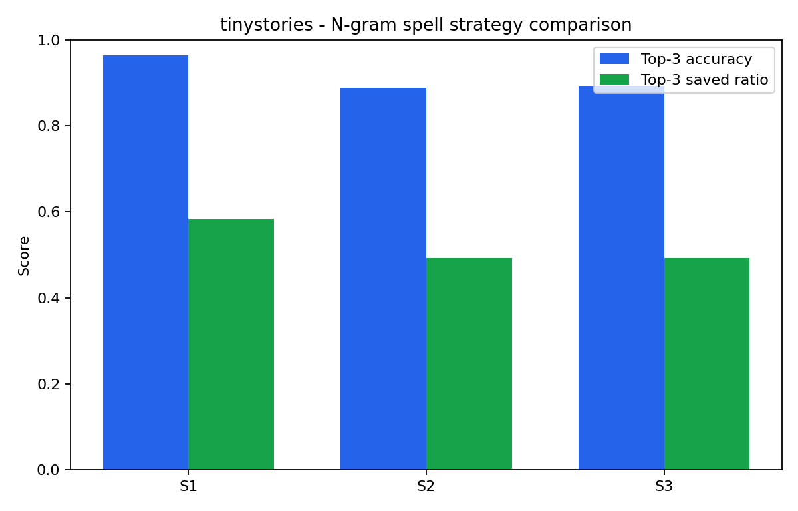
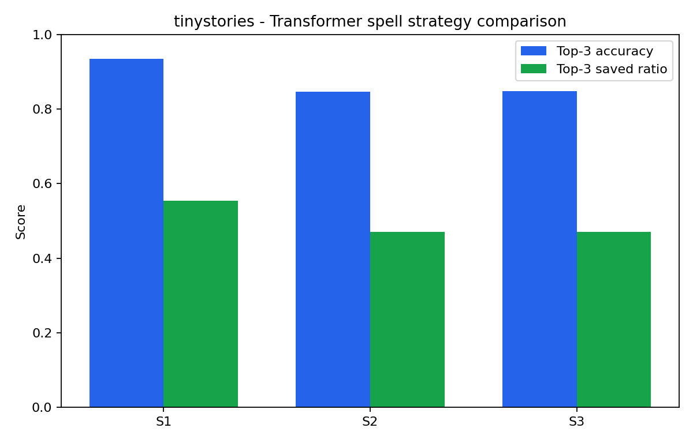
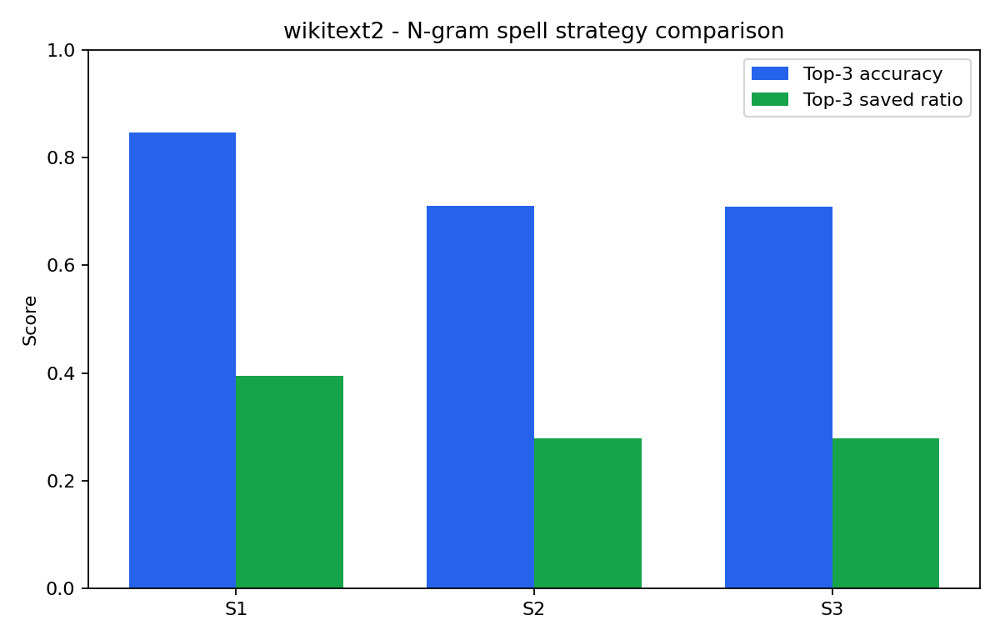
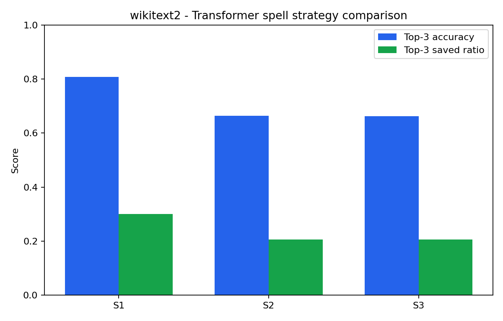
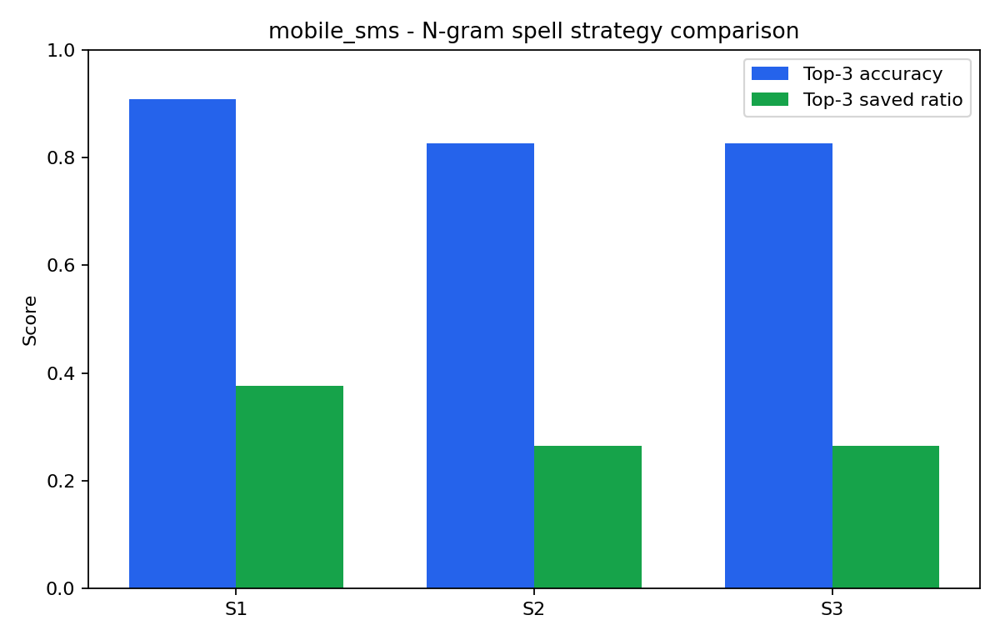
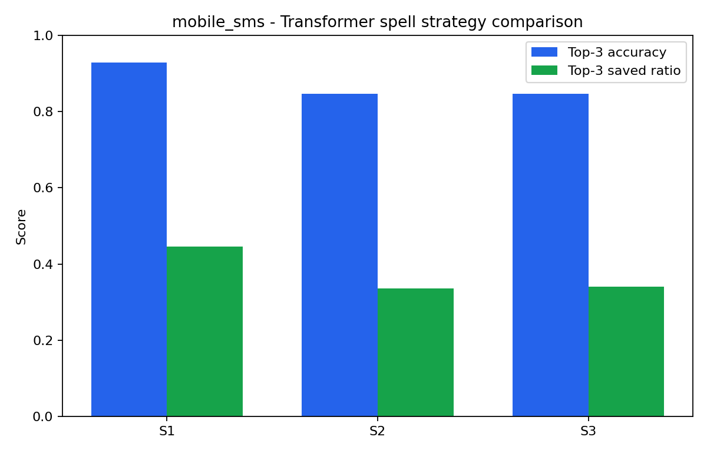

# NLP-project


Project folder overview

```
NLP-Project/

├── data/
│   ├── raw/
│   ├── processed/
│   └── splits/
│       ├── train.txt
│       ├── valid.txt
│       └── test.txt
│
├── models/
│   ├── ngram/
│   └── transformer/
│
├── results/
│   ├── metrics/
│   └── plots/
│
├── scr/
│   ├── preprocessing.py
│   ├── tokenizer.py
│   ├── ngram_model.py
│   ├── transformer_model.py
│   ├── spell_corrector.py
│   ├── suggestion_engine.py
│   ├── evaluate.py
│   └── gui_app.py
│
├── main.py
├── requirements.txt
└── README.md
```

## To test the word predictor, first run:

```bash
python scr/ngram/ngram_train.py
```

## Then run the GUI and start typing

```bash
python scr/gui_app.py
```


# Results

## Summary of Language Model Evaluation

The project now contains results for **TinyStories**, **WikiText-2**, and **Mobile SMS**. The N-gram model was tuned separately for each dataset.

| Dataset | λ1 unigram | λ2 bigram | λ3 trigram | λ4 4-gram |
|---|---:|---:|---:|---:|
| TinyStories | 0.0 | 0.0 | 0.1 | 0.9 |
| WikiText-2 | 0.0 | 0.1 | 0.9 | 0.0 |
| Mobile SMS | 0.0 | 0.1 | 0.7 | 0.2 |

TinyStories benefits most from the 4-gram model, while WikiText-2 and Mobile SMS rely more strongly on trigram context.

## N-gram Word Prediction

### TinyStories test set

| Top-k | Top-k accuracy | Saved keystroke ratio | Saved keystrokes |
|---:|---:|---:|---:|
| 1 | 32.53% | 57.80% | 147,550 |
| 2 | 44.10% | 65.61% | 167,488 |
| 3 | 51.42% | 68.03% | 173,665 |
| 4 | 56.47% | 69.29% | 176,900 |

### WikiText-2 test set

| Top-k | Top-k accuracy | Saved keystroke ratio | Saved keystrokes |
|---:|---:|---:|---:|
| 1 | 16.59% | 40.14% | 154,382 |
| 2 | 22.28% | 48.88% | 188,005 |
| 3 | 26.08% | 52.89% | 203,401 |
| 4 | 28.68% | 55.30% | 212,670 |

WikiText-2 is harder because it has a larger and less repetitive vocabulary. Even so, the saved-keystroke ratio stays relatively high because useful completions often appear after only a few typed characters.

### Mobile SMS validation set

Mobile SMS N-gram tuning was evaluated on the validation split. The best top-3 setting used `λ = {1: 0.0, 2: 0.1, 3: 0.7, 4: 0.2}`.

| Top-k | Accuracy | Saved keystroke ratio | Success rate | Mean chars typed |
|---:|---:|---:|---:|---:|
| 3 | 27.10% | 58.42% | 86.45% | 1.68 |

## Transformer Word Prediction

### Mobile SMS grid search

The Mobile SMS transformer grid search used `block_size=128`, `vocab_size=5000`, `max_iters=10000`, and 20 validation sentences for quick evaluation.

| Architecture | Stride | Blocks | Heads | Dim | Params | Val loss | Top-1 Acc | Top-3 Acc | Top-3 Saved |
|---|---:|---:|---:|---:|---:|---:|---:|---:|---:|
| default | 32 | 4 | 4 | 256 | 5,752,712 | 4.8376 | 90.68% | 96.61% | 58.98% |
| default | 8 | 4 | 4 | 256 | 5,752,712 | 4.8402 | 89.83% | 96.61% | 61.68% |
| small | 32 | 2 | 2 | 128 | 1,696,904 | 5.1143 | 88.98% | 96.19% | 56.80% |
| small | 8 | 2 | 2 | 128 | 1,696,904 | 5.1159 | 88.56% | 96.19% | 57.42% |

The best top-1 grid-search score came from the default transformer with stride 32. The default stride-8 model had the same top-3 accuracy and a higher top-3 saved-keystroke ratio, so it is also a reasonable final-training choice.

### Mobile SMS transformer test sample

The saved transformer Mobile SMS word-prediction result file evaluates 100 test sentences.

| Top-k | Top-k accuracy | Saved keystroke ratio | Saved keystrokes |
|---:|---:|---:|---:|
| 1 | 94.44% | 51.28% | 2,128 |
| 2 | 97.22% | 62.72% | 2,603 |
| 3 | 97.70% | 67.42% | 2,798 |
| 4 | 97.79% | 70.36% | 2,920 |

The result is high because Mobile SMS sentences are short and repetitive compared with TinyStories and WikiText-2. It should be read as an autocomplete evaluation: the target can be found after zero or more typed prefix characters.

### Transformer perplexity

| Dataset | Evaluated tokens | Cross-entropy / NLL | Perplexity |
|---|---:|---:|---:|
| TinyStories | 221,014 | 1.7375 | 5.68 |
| WikiText-2 | 171,455 | 3.9785 | 53.44 |

TinyStories has much lower perplexity, which matches the word-prediction and spell-correction results: it is a simpler, more regular dataset than WikiText-2.

---

## Spell Correction

## What is it and why does it matter?

Normal word prediction assumes you type correctly — it just tries to finish what you started. But what if you make a typo? That's where spell correction comes in. Instead of only looking for words that *start with* what you typed, it also considers words that are *close to* what you typed, even if a character is wrong, swapped, or missing.

In the GUI, spell correction runs alongside word prediction automatically. The moment you enable it and start typing, the suggestion list already accounts for potential typos — so even if you type `"hte"` instead of `"the"`, the correct word can still appear in the suggestions.

## How does it work under the hood?

The core idea is **edit distance** — a measure of how many single-character operations it takes to turn what you typed into a real word. The allowed operations are insert, delete, substitute, or swap two adjacent characters (transposition). For example:

- `"hte"` → `"the"` costs 1 operation (swap `h` and `t`)
- `"recieve"` → `"receive"` costs 1 operation (swap `i` and `e`)
- `"wrold"` → `"world"` costs 1 operation (swap `r` and `l`)

Only words within the edit distance threshold are considered as candidates. Then each candidate gets a score.

With a language model:

```text
score(c) = log P(c | context)  −  λ · (dist / max_dist)  +  μ · log(freq(c) + 1) / max_log_freq
```

Without a language model:

```text
score(c) =  −  λ · (dist / max_dist)  +  μ · log(freq(c) + 1) / max_log_freq
```

Where:

- `P(c | context)` — probability the language model assigns to candidate `c` given the preceding words *(with-LM formula only)*
- `dist` — edit distance between what you typed and the candidate; **the distance function itself depends on the strategy**: S1/S2 use standard Damerau-Levenshtein (all ops cost 1.0), S3 uses a weighted variant where some operations cost less than 1.0
- `max_dist` — the normalizing threshold set by the strategy: `1` for S1, `2` for S2 and S3
- `freq(c)` — how often the word appears in training data
- `λ = 0.5` — how much to penalise candidates that are far from what you typed
- `μ = 0.1` — small frequency boost so common words don't get pushed out

The candidates are ranked by this score, and the top suggestions are shown.

## Choosing a Strategy (S1 / S2 / S3)

The strategy determines two things: the **maximum edit distance** and the **cost model** used when computing that distance.

---

### S1 — Standard Damerau-Levenshtein, max distance = 1

All four operations (insert, delete, substitute, transpose) each cost exactly 1.0. Only words within 1 edit are considered.

```text
cost(insert)     = 1.0
cost(delete)     = 1.0
cost(substitute) = 1.0
cost(transpose)  = 1.0

candidates : words where dist(typed, word) ≤ 1
edit_pen   = dist / 1
```

Good for catching single-character slips — a missing letter, one wrong key, or two swapped letters. Won't recover from larger mistakes.

---

### S2 — Standard Damerau-Levenshtein, max distance = 2

Same uniform costs as S1 but the threshold is relaxed to 2 edits. This catches the majority of real-world typos.

```text
cost(insert)     = 1.0
cost(delete)     = 1.0
cost(substitute) = 1.0
cost(transpose)  = 1.0

candidates : words where dist(typed, word) ≤ 2
edit_pen   = dist / 2
```

The wider net means more candidates compete for the top spots, so the language model or frequency term becomes more important for ranking.

---

### S3 — Weighted Damerau-Levenshtein, max distance = 2

Same threshold as S2, but operations no longer cost the same. Transpositions are cheaper (0.5) because letter swaps are physically common. For substitutions, you can optionally factor in keyboard layout.

#### S3 + Operation weighting

```text
cost(insert)     = 1.0
cost(delete)     = 1.0
cost(substitute) = 1.0
cost(transpose)  = 0.5   ← swapping two adjacent letters is "half a mistake"

candidates : words where weighted_dist(typed, word) ≤ 2
edit_pen   = weighted_dist / 2
```

#### S3 + Keyboard weighting

```text
cost(insert)     = 1.0
cost(delete)     = 1.0
cost(transpose)  = 0.5
cost(substitute) = 0.5   if the two keys are adjacent on QWERTY (Euclidean distance ≤ 1.5)
                 = 1.0   otherwise

candidates : words where weighted_dist(typed, word) ≤ 2
edit_pen   = weighted_dist / 2
```

The keyboard distances are computed from the physical QWERTY layout. For example, `a` → `s` costs 0.5 (neighbours), but `a` → `p` costs 1.0 (far apart). This reflects the reality that adjacent-key substitutions happen much more often by accident.

## Combining with a Language Model

By default, spell correction doesn't use any language model — it just looks at edit distance and word frequency. But you can pair it with one of the trained language models to get context-aware suggestions.

**No model** — purely edit-distance + frequency. Suggestions are the same regardless of what came before. Simple and fast.

**N-gram** — uses the n-gram language model to score candidates based on the words that came before. For example, after typing `"the quick brown"`, it knows `"fox"` is more likely than `"fax"` even if both are equally close to what you typed.

**Transformer** — uses the trained transformer model for the same purpose, but with a much richer context representation. It can consider more of the sentence than the n-gram model, but it is slower and does not always rank spelling-correction candidates better.

When you pick N-gram or Transformer as the language model for spell correction, it takes over the model selection for that session — the prediction panel and the spell correction panel both use the same underlying model.

## Quick Summary

| Setting | What it means |
| --- | --- |
| S1 | Only fix single-character mistakes |
| S2 | Fix up to 2 mistakes (recommended) |
| S3 | Fix up to 2 mistakes, with smarter cost weighting |
| Operation weighting | Swaps cost half as much as inserts/deletes |
| Keyboard weighting | Nearby keys cost less than distant ones |
| No model | Score by edit distance + frequency only |
| N-gram | Add sentence context via n-gram model |
| Transformer | Add sentence context via transformer model |

---

## Spell Correction Evaluation

### What we evaluated

The spell-correction task is slightly different from normal word prediction.

In normal word prediction, the user types the beginning of a correctly spelled word, such as:

```text
he was walking on the str...
```

and the system should suggest:

```text
street
```

In spell correction, the user may type the word incorrectly:

```text
he was walking on the stret
```

and the system should still suggest:

```text
street
```

So the question is: **can the system still suggest the correct word when the typed prefix contains spelling mistakes?**

This is best described as **spell-aware word prediction**. The system updates suggestions while the user types, but the typed word may be misspelled.

### How the corrupted test data was created

For this evaluation, fixed corrupted test sets were created from the N-gram test files:

```text
scr/data/tiny_stories/tinystories_test.txt
scr/data/wikitext_2/wikitext2_test.txt
scr/data/mobile_ngram/test_sms.txt
```

Each test example was made as follows:

1. Randomly choose a sentence from the test data.
2. Keep only sentences with at least two words.
3. Use all words except the last word as the context.
4. Use the last word as the correct target word.
5. Corrupt only the last word.
6. Store the context, the corrupted word, the correct word, and the edit operation.

For example:

```json
{
  "context": ["he", "was", "walking", "on", "the"],
  "corrupted": "stret",
  "target": "street",
  "edit_type": "deletion",
  "display_sentence": "he was walking on the stret <street>"
}
```

Two corrupted test files were created for each dataset:

| File | Meaning |
|---|---|
| `test_edit1.jsonl` | The final word has exactly 1 edit |
| `test_edit2.jsonl` | The final word has exactly 2 edits |

The corrupted word had to satisfy the following conditions:

- the sentence has at least two words
- the sentence contains only alphabetic word tokens after basic cleaning
- the target word is the final word in the sentence
- the target word is longer than one character
- the corrupted word is different from the target
- the corrupted word is longer than one character
- the corrupted word has exactly the requested edit distance
- the corrupted word is not already a normal word in the corpus vocabulary

This last point avoids confusing examples where a typo accidentally becomes another real word.

### How S1, S2, and S3 were evaluated

The same corrupted files were used for both the N-gram model and the Transformer model. This makes the comparison fair.

| Strategy | Test file | Edit-distance setting |
|---|---|---|
| S1 | `test_edit1.jsonl` | Standard edit distance, maximum distance 1 |
| S2 | `test_edit2.jsonl` | Standard edit distance, maximum distance 2 |
| S3 | `test_edit2.jsonl` | Weighted edit distance, maximum distance 2 |

S3 uses the same two-edit examples as S2. The difference is that S3 gives a lower cost to transpositions, because swapped neighbouring letters are common typing mistakes.

### How simulated typing was used

The evaluation simulates a user typing the corrupted word one character at a time.

For example, if the correct word is:

```text
walking
```

and the corrupted word is:

```text
wakiln
```

the evaluator checks suggestions after:

```text
w
wa
wak
waki
wakil
wakiln
```

The full corrupted word is included. If the correct word appears only after the full corrupted word has been typed, it still counts as a successful correction, but it may save few or no keystrokes.

The two main metrics are:

| Metric | Meaning |
|---|---|
| Top-k accuracy | How often the correct word appears in the top `k` suggestions |
| Saved-keystroke ratio | How much typing was saved by suggesting the correct word early |

For example, top-3 accuracy means:

```text
Was the correct word one of the three suggestions?
```

Saved-keystroke ratio means:

```text
Out of all characters the user intended to type, what fraction did the system save?
```

Examples where the correct target word was not in the model vocabulary were skipped, because the model could not possibly suggest them. This is why WikiText-2 has more skipped examples than TinyStories and Mobile SMS.

### Scoring setup

Both models used the same spell-correction scoring formula:

```text
score(candidate) =
    log P(candidate | context)
    - λ_edit · normalized_edit_distance
    + μ_freq · normalized_word_frequency
```

The TinyStories and WikiText-2 spell-correction results below used:

```text
λ_edit = 0.5
μ_freq = 0.1
```

The Mobile SMS spell-correction results used the validated Mobile SMS setting:

```text
λ_edit = 1.0
μ_freq = 0.05
```

The N-gram model used the previously tuned N-gram interpolation weights. The Transformer model used its trained checkpoint and tokenizer. The spell-correction examples were the same for both models.

---

## Spell Correction Results

The following tables show both **top-k accuracy** and **saved-keystroke ratio** for `top_k = 1, 2, 3, 4`.

In the tables:

```text
Acc   = top-k accuracy
Saved = saved-keystroke ratio
Eval/OOV = evaluated examples / skipped out-of-vocabulary examples
```

### TinyStories

| Strategy | Model | Eval/OOV | Top-1 Acc | Top-1 Saved | Top-2 Acc | Top-2 Saved | Top-3 Acc | Top-3 Saved | Top-4 Acc | Top-4 Saved |
|---|---|---:|---:|---:|---:|---:|---:|---:|---:|---:|
| S1 | N-gram | 999/1 | 90.09% | 46.12% | 94.69% | 54.47% | 96.40% | 58.41% | 97.10% | 60.95% |
| S1 | Transformer | 999/1 | 86.69% | 43.96% | 91.19% | 51.91% | 93.39% | 55.43% | 94.69% | 57.66% |
| S2 | N-gram | 999/1 | 77.88% | 35.00% | 85.39% | 44.10% | 88.79% | 49.16% | 90.59% | 52.31% |
| S2 | Transformer | 999/1 | 74.67% | 35.50% | 81.38% | 43.14% | 84.58% | 47.04% | 85.99% | 49.41% |
| S3 | N-gram | 999/1 | 78.48% | 35.10% | 85.79% | 44.10% | 89.19% | 49.14% | 90.89% | 52.39% |
| S3 | Transformer | 999/1 | 74.87% | 35.56% | 81.38% | 43.20% | 84.78% | 47.10% | 86.09% | 49.45% |

### WikiText-2

| Strategy | Model | Eval/OOV | Top-1 Acc | Top-1 Saved | Top-2 Acc | Top-2 Saved | Top-3 Acc | Top-3 Saved | Top-4 Acc | Top-4 Saved |
|---|---|---:|---:|---:|---:|---:|---:|---:|---:|---:|
| S1 | N-gram | 902/98 | 73.28% | 26.03% | 81.71% | 34.92% | 84.70% | 39.41% | 85.59% | 41.72% |
| S1 | Transformer | 902/98 | 69.51% | 17.68% | 78.49% | 25.89% | 80.71% | 29.98% | 82.15% | 32.45% |
| S2 | N-gram | 902/98 | 55.99% | 17.29% | 65.63% | 24.10% | 71.06% | 27.80% | 72.95% | 29.70% |
| S2 | Transformer | 902/98 | 53.10% | 11.53% | 62.20% | 17.55% | 66.41% | 20.65% | 69.40% | 23.09% |
| S3 | N-gram | 902/98 | 57.32% | 17.61% | 66.08% | 24.46% | 70.84% | 27.87% | 72.39% | 29.89% |
| S3 | Transformer | 902/98 | 53.10% | 11.50% | 62.42% | 17.59% | 66.30% | 20.65% | 69.07% | 23.00% |

### Mobile SMS

The Mobile SMS spell-correction evaluation was run on 100 examples.

| Strategy | Model | Eval/OOV | Top-1 Acc | Top-1 Saved | Top-2 Acc | Top-2 Saved | Top-3 Acc | Top-3 Saved | Top-4 Acc | Top-4 Saved |
|---|---|---:|---:|---:|---:|---:|---:|---:|---:|---:|
| S1 | N-gram | 98/2 | 82.65% | 27.73% | 88.78% | 34.01% | 90.82% | 37.65% | 90.82% | 40.69% |
| S1 | Transformer | 98/2 | 88.78% | 32.59% | 91.84% | 38.87% | 92.86% | 44.53% | 93.88% | 47.77% |
| S2 | N-gram | 98/2 | 63.27% | 13.97% | 76.53% | 20.24% | 82.65% | 26.52% | 83.67% | 28.95% |
| S2 | Transformer | 98/2 | 74.49% | 21.66% | 82.65% | 29.76% | 84.69% | 33.60% | 86.73% | 38.87% |
| S3 | N-gram | 98/2 | 64.29% | 14.37% | 76.53% | 20.85% | 82.65% | 26.52% | 84.69% | 29.15% |
| S3 | Transformer | 98/2 | 75.51% | 21.66% | 82.65% | 29.96% | 84.69% | 34.01% | 86.73% | 38.87% |

### Relevant plots

These plots show the top-3 strategy comparison for each model and dataset.













More detailed plots are saved under:

```text
results/plots/ngram_spell_plots/
results/plots/transformer_spell_plots/
```

These include plots by edit operation and by the number of words before the corrupted word.

---

## Discussion of Spell Correction Results

### S1 is easier than S2 and S3

S1 has only one spelling mistake, so it is the easiest setting. Both models perform best on S1.

For example, on TinyStories with top-3 suggestions:

| Model | S1 top-3 accuracy | S2 top-3 accuracy |
|---|---:|---:|
| N-gram | 96.40% | 88.79% |
| Transformer | 93.39% | 84.58% |

This is expected. With two mistakes, the corrupted prefix can be much farther from the correct word. More wrong candidates become possible, so ranking the correct word becomes harder.

### TinyStories and Mobile SMS are easier than WikiText-2

Both models perform better on TinyStories than on WikiText-2. Mobile SMS is also easier for the Transformer in the 100-example spell-correction run, although it was evaluated on a smaller sample.

TinyStories has simpler sentences and more repeated patterns. Mobile SMS has very short messages and frequent common phrases. WikiText-2 has more varied vocabulary, names, rare words, and longer contexts, which makes it harder for spelling correction.

The number of skipped examples also shows this:

| Dataset | Loaded examples | Evaluated examples | Skipped OOV |
|---|---:|---:|---:|
| TinyStories | 1,000 | 999 | 1 |
| WikiText-2 | 1,000 | 902 | 98 |
| Mobile SMS | 100 | 98 | 2 |

WikiText-2 has many more target words that were outside the model vocabulary, so those examples had to be skipped.

### Model comparison for spell correction

For TinyStories and WikiText-2, the N-gram model performed better than the Transformer. On Mobile SMS, the Transformer performed better in the 100-example run.

At top-3:

| Dataset | Strategy | N-gram accuracy | Transformer accuracy | N-gram saved | Transformer saved |
|---|---|---:|---:|---:|---:|
| TinyStories | S1 | 96.40% | 93.39% | 58.41% | 55.43% |
| TinyStories | S2 | 88.79% | 84.58% | 49.16% | 47.04% |
| TinyStories | S3 | 89.19% | 84.78% | 49.14% | 47.10% |
| WikiText-2 | S1 | 84.70% | 80.71% | 39.41% | 29.98% |
| WikiText-2 | S2 | 71.06% | 66.41% | 27.80% | 20.65% |
| WikiText-2 | S3 | 70.84% | 66.30% | 27.87% | 20.65% |
| Mobile SMS | S1 | 90.82% | 92.86% | 37.65% | 44.53% |
| Mobile SMS | S2 | 82.65% | 84.69% | 26.52% | 33.60% |
| Mobile SMS | S3 | 82.65% | 84.69% | 26.52% | 34.01% |

The TinyStories and WikiText-2 result may seem surprising because Transformers are usually stronger language models. However, this spell-correction setup is very word-based:

1. First, the system finds candidate words close to the typed misspelling.
2. Then it ranks those whole-word candidates.
3. The N-gram model scores whole words directly.
4. The Transformer uses subword tokens, so scoring a full candidate word can be less direct.

In other words, clean word prediction mainly tests language modeling. Spell correction tests a combination of edit distance, word frequency, candidate generation, and language-model scoring. The N-gram model is simple, but it fits this word-level candidate-ranking pipeline very well. The Mobile SMS result shows that the Transformer can still be competitive when the text is short and repetitive.

### S3 only changed the results slightly

S3 uses weighted edit distance, where transpositions are cheaper than other edits. Overall, S3 was very close to S2.

For example, on WikiText-2 with the N-gram model:

| Strategy | Top-3 accuracy | Top-3 saved ratio |
|---|---:|---:|
| S2 | 71.06% | 27.80% |
| S3 | 70.84% | 27.87% |

This means weighted edit distance did not dramatically change the overall result. It may still help for specific typo types such as transpositions, but the full test set contains many different edit combinations, so the total average stays close to S2.

### Top-k tradeoff

Showing more suggestions improves both accuracy and saved keystrokes. For example, on TinyStories S2 with the N-gram model:

| Top-k | Accuracy | Saved ratio |
|---:|---:|---:|
| 1 | 77.88% | 35.00% |
| 2 | 85.39% | 44.10% |
| 3 | 88.79% | 49.16% |
| 4 | 90.59% | 52.31% |

Top-4 gives the best score, but top-3 is still a reasonable practical choice because it gives strong performance without showing too many suggestions.

---

## Spell-Parameter Validation Note

Small validation experiments were run to tune `λ_edit` and `μ_freq`. TinyStories and WikiText-2 used 100 corrupted validation examples; Mobile SMS used 20 examples.

```text
λ_edit ∈ {0.25, 0.5, 0.75, 1.0}
μ_freq ∈ {0.05, 0.1, 0.2}
```

The objective was top-3 saved-keystroke ratio.

The best validation settings were:

| Dataset | Strategy used for validation | Best λ_edit | Best μ_freq | Top-3 validation accuracy | Top-3 validation saved ratio |
|---|---|---:|---:|---:|---:|
| TinyStories | S2 | 1.0 | 0.05 | 91.00% | 51.95% |
| TinyStories | S3 | 1.0 | 0.05 | 90.00% | 51.95% |
| WikiText-2 | S3 | 1.0 | 0.20 | 71.88% | 27.30% |
| Mobile SMS | S3 | 1.0 | 0.05 | 90.00% | 32.48% |

